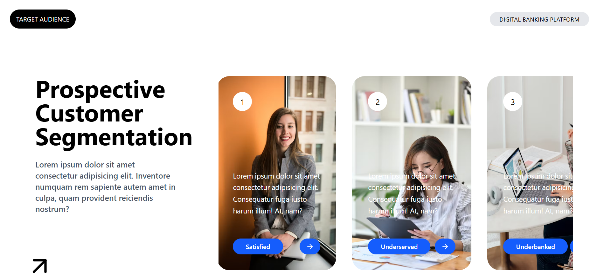

# Basic UI Project (React + Tailwind)

A small React project showcasing prospective customer segmentation for a digital banking platform.  
Built with **React**, **Vite**, and **Tailwind CSS**.

## 🚀 Live Demo
[Demo Link](https://basic-ui-project.netlify.app/)

## 🖼️ Screenshot


## 🛠️ Tech Stack
- React
- Vite
- Tailwind CSS

## 📦 Installation & Setup
Clone the repo and install dependencies:

```bash
git clone https://github.com/DhanashriWayal/basic-ui-project.git
cd basic-ui-project
npm install
npm run dev
